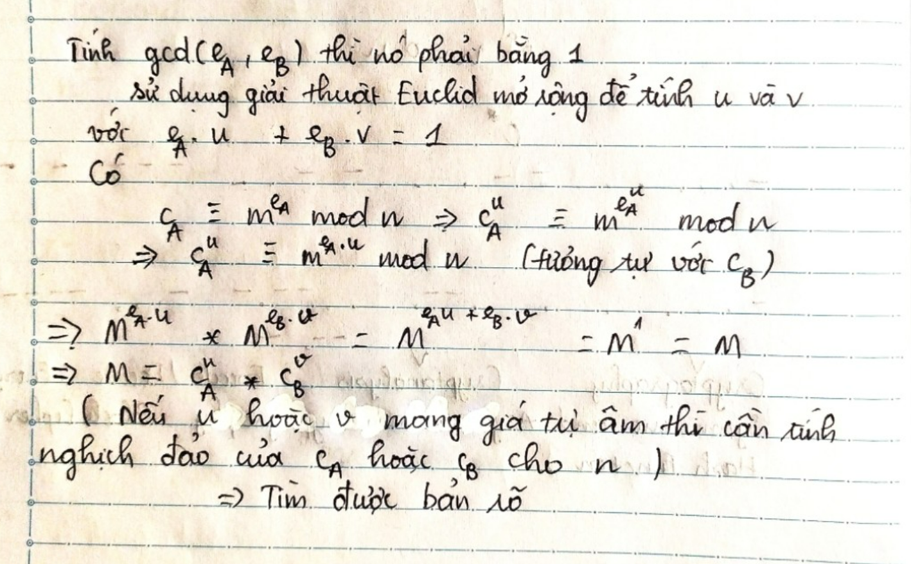

# KCSC-Training

## I. RSA 1
>Decription: [ciphertext](ciphertext) và [key](key.pem)  

``` Bài đầu tiên này khá đơn giản, mình chỉ cần download 2 file đề bài cho. File đầu tiên là ciphertext chứa bản mã c, file còn lại là key.pem có chứa key của đề bài. Do việc đọc file key đã cho ra số modulo n, số mũ mã hoá e, số mũ giải mã d nên việc còn lại chỉ cần tính c^d mod n là xong.```
```python
from Crypto.PublicKey import RSA
from Crypto.Util.number import *
f = open('key.pem','r')
key = RSA.importKey(f.read())
n = key.n
e = key.e
d = key.d
ct = open('ciphertext','rb').read()
c = bytes_to_long(ct)
print(long_to_bytes(pow(c,d,n)))
```
>flag: KCSC{G00d_j0b_!!!______RSA_RSA_RSA}
## II. RSA 2
>Decription: small_primes.txt

```
n = 9535271629301589543980737788527614014746809465076973703910968482522722398246280610827753553656401385478044310802319122874965273190562705759366029705507
e = 65537
c = 4552577387909336101290973882061311505705840831095295560114130894123462456438533356021283525714896620886904381766963261172543338282153176336375423711746
```
>Việc đầu tiên mình làm khi gặp mấy bài RSA là đưa n lên các tool online để factor chúng. Trong bài này cũng thế, đưa n lên [factorN](https://www.alpertron.com.ar/ECM.HTM). Modulo N ở bài này là tích của nhiều số nguyên tố, tính phiN = (p1-1)...(pn-1), đã có phiN thì tính d dễ dàng rồi.
```python
from Crypto.Util.number import*
n = 9535271629301589543980737788527614014746809465076973703910968482522722398246280610827753553656401385478044310802319122874965273190562705759366029705507
e = 65537
c = 4552577387909336101290973882061311505705840831095295560114130894123462456438533356021283525714896620886904381766963261172543338282153176336375423711746
n_primes = [809378587157807839 , 7386670803860734511 , 7844836778895444071 , 8746422467282253197 , 8958860398532938877 , 10933341879030203071,13937745649330813241,17026289712509249947]
phi = 1
for i in n_primes:
    phi *= i-1
d = pow(e,-1,phi)
m = long_to_bytes(pow(c,d,n))
print(m)
```
>flag: KCSC{sm4ll_pr1m3s_RSA}

## III. RSA 3
```Decryption:```
```python
from Crypto.Util.number import *

p = getPrime(1024)
q = getPrime(1024)
n = p*q
e1 = 65537
e2 = 75149

flag = b"KCSC{??????????????????????????????}"
flag = bytes_to_long(flag)


# print("n =", n)
# print("e1 =", e1)
# print("e2 =", e2)
# print("c1 =", pow(flag, e1, n))
# print("c2 =", pow(flag, e2, n))


"""
n = 15579041570549183877401062883225064299178659043622586326963894017668885771169636712942686974999467879138974673149238487346310183336299089723487535740955948164498209901918300643614745826133137188932678606032108627681713691545274099467785963695418741480158320568510332737549597969492465647544816476555527239578233498209294274834241435820100991805128484208187048402940657482492065868157791190013243763420906365240091105428192424185460937658483639186279855483707861986225957226824310616917954908062532412789164114438795637888280201795046396416617689806171608152291471471949544980200060392170827892405521363533899736434247
e1 = 65537
e2 = 75149
c1 = 958526646277295724168009763547786278668380497329915140390103080680844142220311835231176539706940958185703282540090844790805926548562491707936898169971263214280928361192803914900711720516558785577328679478102652166699188348694283992899346710699398385080627647392716832230871696605207075465964043078170464673712948247266791210646386374224164686149805328815931460563641454551397839079551430437448424836655869893565997221053407805155266300105570480915918775573741222285317386894157207021041886667232226686999026179007570092208455517449469430164063484188279221791507821580835493377236195443037703666043783154843296991980
c2 = 3364518837513546914916005862604690518243236022813143522634472702326113779354144548308524567399600026328302880849426586750023085953031035137263786380775479526123612089514173828715534956705435799574041315156819482550812270343681022195190739255746660599014578195344360880947115223661898250852906842786202954907911849356980822061691461413625527967303128318228029968148086918927848492525738193529285664626595877347027761575638243519289812130710352217003140546189017707851552139715658490173123320649047145805707417652762434393193118047679875378528913314061444052618140209949527982609241727893221732721184392506829957203306
"""
```
>Bài này sử dụng chung modul n, cách giải như sau: 
```python 
n = 15579041570549183877401062883225064299178659043622586326963894017668885771169636712942686974999467879138974673149238487346310183336299089723487535740955948164498209901918300643614745826133137188932678606032108627681713691545274099467785963695418741480158320568510332737549597969492465647544816476555527239578233498209294274834241435820100991805128484208187048402940657482492065868157791190013243763420906365240091105428192424185460937658483639186279855483707861986225957226824310616917954908062532412789164114438795637888280201795046396416617689806171608152291471471949544980200060392170827892405521363533899736434247
e1 = 65537
e2 = 75149
c1 = 958526646277295724168009763547786278668380497329915140390103080680844142220311835231176539706940958185703282540090844790805926548562491707936898169971263214280928361192803914900711720516558785577328679478102652166699188348694283992899346710699398385080627647392716832230871696605207075465964043078170464673712948247266791210646386374224164686149805328815931460563641454551397839079551430437448424836655869893565997221053407805155266300105570480915918775573741222285317386894157207021041886667232226686999026179007570092208455517449469430164063484188279221791507821580835493377236195443037703666043783154843296991980
c2 = 3364518837513546914916005862604690518243236022813143522634472702326113779354144548308524567399600026328302880849426586750023085953031035137263786380775479526123612089514173828715534956705435799574041315156819482550812270343681022195190739255746660599014578195344360880947115223661898250852906842786202954907911849356980822061691461413625527967303128318228029968148086918927848492525738193529285664626595877347027761575638243519289812130710352217003140546189017707851552139715658490173123320649047145805707417652762434393193118047679875378528913314061444052618140209949527982609241727893221732721184392506829957203306
# m = xgcd(e1,e2)
# m = (1, 32219, -28098)
u = 32219
v = -28098
c2 = pow(c2,-1,n)
m = (pow(c1, u,n))*(pow(c2, -v,n))
m = 146211067955251991669330241535417700163125759665087445158214692791377060879152864780157
print(long_to_bytes(m))
```
>flag:  KCSC{_c0mm0n_m0dulus_______________}

## IV. RSA 4

>Decription: Just send your ciphertext and we will decrypt it... nc 45.77.45.157 2001 
```
N = 19153769455111105856256118975510539313173683893315352040405379802639103533322215460957819178664803589086090036265609695083209838061565646210785366060669397295163637840908924911219949719188698244252237809305330223072839811615898504506308286871567009748425586561252258753092436810874255997310394589666520519491361697942429372868954935499499683661711830952176260803873589752836570068591947973873860225175738999741296138574935499692715380487515002206519640558532746751133264544684462856090197154428907509470102300196621440673367465325552799592237267824278986037603028606361416826656651235374458117103799808476324198810469
e = 65537
Encrypted flag = 10877686160945230224601797228364519771801467547242512244541455278786695297903072088713046692908675258359467974156348681372943291911917527838443960374235655762345694815641702494154668036953562266780690614392431830587831131681608871600038633447635937475476360141322132847898096551139083668858814361179609321991972670743523147518104136408152749831163791278020920954565580940988882647820226769846408357385115297509090006752266822878360765252183112598529632257300547955803651651701672512026144009810289689865785349170330840341387542411762092528038896321851881915695428341720324002187271485567513641899523721647729798204576
Input your ciphertext:
Input a number other than `Encrypted flag`.
```
>Đề bài đã gợi ý "chỉ cần gửi bản mã của bạn, chúng tôi sẽ giải mã nó..". Và sau khi kết nối được đến server mình nhận được N,e và flag đã được mã hoá. Có thể hiểu như sau: 

```python
from Crypto.Util.number import *
N = 19153769455111105856256118975510539313173683893315352040405379802639103533322215460957819178664803589086090036265609695083209838061565646210785366060669397295163637840908924911219949719188698244252237809305330223072839811615898504506308286871567009748425586561252258753092436810874255997310394589666520519491361697942429372868954935499499683661711830952176260803873589752836570068591947973873860225175738999741296138574935499692715380487515002206519640558532746751133264544684462856090197154428907509470102300196621440673367465325552799592237267824278986037603028606361416826656651235374458117103799808476324198810469
e = 65537
m = 10877686160945230224601797228364519771801467547242512244541455278786695297903072088713046692908675258359467974156348681372943291911917527838443960374235655762345694815641702494154668036953562266780690614392431830587831131681608871600038633447635937475476360141322132847898096551139083668858814361179609321991972670743523147518104136408152749831163791278020920954565580940988882647820226769846408357385115297509090006752266822878360765252183112598529632257300547955803651651701672512026144009810289689865785349170330840341387542411762092528038896321851881915695428341720324002187271485567513641899523721647729798204576

print(((2**65537)*m)%N)
p = 1038892122233357139058894143364470935388104815466022283445225336070395642//2
print(long_to_bytes(p))
```
>flag: KCSC{ch0sen_c1phertext_4tt4ck}

## V. RSA 5

>Decryption : Wiener-attack.txt
```
n = 4132976885313620989793138232237857485698296237464660843315969036074678733191191577685180205697480631542751907366655945998120743803779982256919952243360171622255710620255448449934374799426944976112754122373672543300475307874859246944968687601079412328357824701323041241341274623879229479225565485630084007195867934589763500476352488857570266688948676558779645051259275472615017031239454654649250067852440038216514254375247334297284709102711047491074903964306850091668210467313746721
e = 1750050028811042317092326965718758083501771847947887293515411772102890164760552659457975064653911340940187822648462652483456640570963224225417353368313169226726553908832781209174212992300450276992090024394416526941239015616616221568602574848593841017150941057063859910043814071580107820286653129237982205855538973817418438652522623026562425971136775219067133693665110372249308179365513518843406292774596623071641859580717087301634730699160968730685078033151203026378458630658027183
c = 281833041089031329877955708537883567595102587735700060795910832047971578904265919004493566623179634029899784120656782497079401966828978655173874757033079671295302908540302580553411001062296038906480815096344660583927786701256080412482545291031999575562354075125133028508948916979768605898769848805716444664173353566191136536691509637139284690177133420104271519555154357534379993283611943343212541981157950089731344739020706609848032078220759256353608507103460929949946267236256484
```


> Thấy số mũ e là rất lớn nên d sẽ nhỏ, đây là kiểu tấn công Wiener.

```python 
from Crypto.Util.number import *
n = 4132976885313620989793138232237857485698296237464660843315969036074678733191191577685180205697480631542751907366655945998120743803779982256919952243360171622255710620255448449934374799426944976112754122373672543300475307874859246944968687601079412328357824701323041241341274623879229479225565485630084007195867934589763500476352488857570266688948676558779645051259275472615017031239454654649250067852440038216514254375247334297284709102711047491074903964306850091668210467313746721
e = 1750050028811042317092326965718758083501771847947887293515411772102890164760552659457975064653911340940187822648462652483456640570963224225417353368313169226726553908832781209174212992300450276992090024394416526941239015616616221568602574848593841017150941057063859910043814071580107820286653129237982205855538973817418438652522623026562425971136775219067133693665110372249308179365513518843406292774596623071641859580717087301634730699160968730685078033151203026378458630658027183
c = 281833041089031329877955708537883567595102587735700060795910832047971578904265919004493566623179634029899784120656782497079401966828978655173874757033079671295302908540302580553411001062296038906480815096344660583927786701256080412482545291031999575562354075125133028508948916979768605898769848805716444664173353566191136536691509637139284690177133420104271519555154357534379993283611943343212541981157950089731344739020706609848032078220759256353608507103460929949946267236256484

import owiener
d=owiener.attack(e,n)
print(long_to_bytes(pow(c,d,n)))
```
>flag: KCSC{Wiener's_attack__and__the_continued_fraction_method}

## VI. RSA 6
>Decription: rsa_broadcast1.txt
```
e = 3
n1 = 15211798436362885588723897472623293108591910720248957088525019147693538931418263644191188384087192671444613094034228918351752803921214902780115562729109781194564524730616678647299169668840956022253982803940312167051028025651451365086567411697105580823877496322214373858833329503752687389688721464285614416771633832582443831661924525300740587474479915929822185275968765754620639022007556456154273657783836757234869195977992123246001228697364075063631187467467697745958645305050039195409454420883812093851985406438672509679246467362469273159499487930727024310388797737943309901526797320729580549192841964736229600813437
n2 = 21626591969748724512355177924918151334158692957275724877201419607370019278469828125430933124647057504933171869087241002295484088598636458608105322242001060441558558278797676461391977116810622817635779677982150953706982381323844252445458244135760020640138808906951682479395863864919549962007373607664366817674762287851196714326243612440231068277212588495380690697891854959356395382045100868123379468012270186296103993203562175010292310086073927253450438086216611208684799637796464261482073508874703244824884346950888805872923441649245961999831565337681569234397762306502810178342042653449265916866561749583475708506489
n3 = 19097512400706369325816400961039266520829132024949428791526363177058945505751899029358156804216166758940650597868797785258374150813571509380064038840061726644717439998319734158962470548255317210745880084736970984390975595882829502051653319165598723830478149695519141929068772902346767236824342095368037621017207832466086004587771992170123884424073079485433784440021512429824282637400305642774699534138130348712885010916063585549753598230434385619415390706485902887757182780700303004691590541073975281734461423828352816003269155485065897617967030890926979120590779492197580892502646039371764232471906522526296219044183
c1 = 3251198529556591276640909876291141541737775776637150826274246892380018296361827635107478892116516384634504571893928896554767181567637566254415357054493250586599382503595829321201216536132199851851618953852014243314378960676373786613246133182982555838167962717812421434737360297550708423100886906991055921147284735674702176413796610353804517146466379878388359517757702427076082967853155861099707602779621105223657419322088524733685896548987843869707507601904751483232766421541178894496409959520397121463742851694646049947955175502597943566531090437882873905976886981851527484314251722489360942946805553642641785533871
c2 = 15135217823526097772519900957933040202807636182314280311189695893431054786303987708413474068415707150513323386429214635854762776745555347371832883008219672632749941935077295393195697128178492924391678205067775743757767823864584237860003012359695072221700711595856530791714211924064550268243631243362766987128956040475445498266176256225045064611375849108128270761940506410647731412975500973418593459625869469510858206856760736855983352421016179474694787887698754428107461346078193499703174230170749626788692302178224413858188847383010551271438663317946456212396542276796630964988477451722975130905027330444176318042328
c3 = 15355054927350813303626858433403916623058859059252777554479910220092612925381550409545199089214160097848435742400812973625531286808230922571593810018171046879915634188717607339504062256793383771946376984232533453731145028391895516576634761731653648183572968742139920212951333594010550127064134533054100929996820183698904676540298678839115953892905947613857277985039554670042470713722826404341171096982285681133879305459751292317392125967997245763135235288243153509814572254592078683963265503724069453798934980668326437279129145084847542959442317212953913062182429893663058924717141868300505345393715099015666896636500
```
>Với cùng một bãn rõ, người gửi gửi cho nhiều bên với cùng số mũ mã hoá nhưng khác modul n. Đây chính là lỗ hổng mà tấn công Broadcast nhắm vào. Ở đây sẽ sử dụng định lý phần dư trung hoa để giải mã
```python
from Crypto.Util.number import *
import gmpy2 

e = 3
n1 = 15211798436362885588723897472623293108591910720248957088525019147693538931418263644191188384087192671444613094034228918351752803921214902780115562729109781194564524730616678647299169668840956022253982803940312167051028025651451365086567411697105580823877496322214373858833329503752687389688721464285614416771633832582443831661924525300740587474479915929822185275968765754620639022007556456154273657783836757234869195977992123246001228697364075063631187467467697745958645305050039195409454420883812093851985406438672509679246467362469273159499487930727024310388797737943309901526797320729580549192841964736229600813437
n2 = 21626591969748724512355177924918151334158692957275724877201419607370019278469828125430933124647057504933171869087241002295484088598636458608105322242001060441558558278797676461391977116810622817635779677982150953706982381323844252445458244135760020640138808906951682479395863864919549962007373607664366817674762287851196714326243612440231068277212588495380690697891854959356395382045100868123379468012270186296103993203562175010292310086073927253450438086216611208684799637796464261482073508874703244824884346950888805872923441649245961999831565337681569234397762306502810178342042653449265916866561749583475708506489
n3 = 19097512400706369325816400961039266520829132024949428791526363177058945505751899029358156804216166758940650597868797785258374150813571509380064038840061726644717439998319734158962470548255317210745880084736970984390975595882829502051653319165598723830478149695519141929068772902346767236824342095368037621017207832466086004587771992170123884424073079485433784440021512429824282637400305642774699534138130348712885010916063585549753598230434385619415390706485902887757182780700303004691590541073975281734461423828352816003269155485065897617967030890926979120590779492197580892502646039371764232471906522526296219044183
c1 = 3251198529556591276640909876291141541737775776637150826274246892380018296361827635107478892116516384634504571893928896554767181567637566254415357054493250586599382503595829321201216536132199851851618953852014243314378960676373786613246133182982555838167962717812421434737360297550708423100886906991055921147284735674702176413796610353804517146466379878388359517757702427076082967853155861099707602779621105223657419322088524733685896548987843869707507601904751483232766421541178894496409959520397121463742851694646049947955175502597943566531090437882873905976886981851527484314251722489360942946805553642641785533871
c2 = 15135217823526097772519900957933040202807636182314280311189695893431054786303987708413474068415707150513323386429214635854762776745555347371832883008219672632749941935077295393195697128178492924391678205067775743757767823864584237860003012359695072221700711595856530791714211924064550268243631243362766987128956040475445498266176256225045064611375849108128270761940506410647731412975500973418593459625869469510858206856760736855983352421016179474694787887698754428107461346078193499703174230170749626788692302178224413858188847383010551271438663317946456212396542276796630964988477451722975130905027330444176318042328
c3 = 15355054927350813303626858433403916623058859059252777554479910220092612925381550409545199089214160097848435742400812973625531286808230922571593810018171046879915634188717607339504062256793383771946376984232533453731145028391895516576634761731653648183572968742139920212951333594010550127064134533054100929996820183698904676540298678839115953892905947613857277985039554670042470713722826404341171096982285681133879305459751292317392125967997245763135235288243153509814572254592078683963265503724069453798934980668326437279129145084847542959442317212953913062182429893663058924717141868300505345393715099015666896636500
list_n = [n1,n2,n3]
list_c = [c1,c2,c3]

N = n1*n2*n3
N1 = N//n1
N2 = N//n2
N3 = N//n3

u1 = gmpy2.invert(N1, n1)
u2 = gmpy2.invert(N2, n2)
u3 = gmpy2.invert(N3, n3)

M = (c1*u1*N1 + c2*u2*N2 + c3*u3*N3) % N

m = gmpy2.iroot(M,e)[0]

print(long_to_bytes(m))
```
>flag: KCSC{H4st4d's_bro4dc4st_4tt4ck}


## VII. RSA 7
>Decription: rsa_broadcast2.txt
```
e = 3
n1 = 23184700367690596303406550971928697673315695312120525291456094122743742010016226301759318172591899439376799808431685941527169796776570743899979298554409005480153307551428665749149948060630315726553523447633277065840678480457315050245040918863351241692825077299152872409567666573886374862312965387327079627891721566639535535296901623370762481713155628281232602588768627992242131939884638263075618744867111618723241992478956699889502912543123038633344429842749463260874052018112608941224856134564195347101056078761675907073360789141915885496838102884913576944025216977647088726652239424061138854393257556520240785344373
n2 = 16598614154706972613420271784041125815410748531927792645441917414795252248850438735450206608019760097831684217289403926030457577087296106956317039703951800836861403186216641885780852987165403401697525821473826262674886082931962185244493330904097197340110215380613208151944566195249874443613282112190739152189814826718021904731418965163730919542916269293435112103504280600213923559249751280865152404050874882009908096226969114758173139152709837189758453204197064328057840694362428909554382342827148993177283611306667670265691995707445776879457625204260502242548687534619027985025487711115404523481782960174504732857009
n3 = 18023432020300442738738062448416035717919461455011042240759145335434574003080342934635551455204032299361120919980695845642250348164536381756118840024408657214977332180398244581545784738124088948227145231355190757784051824978257570968860355941532904863315988162884103972768088720444842728795771351658266591483544109850462942678247121628487231978667969236923701711260500813287056433101477185900687648799589024395603183687507382390297084295802618279215173280355268385860909746021503791135390838338964209264691204955162908187234076148039007653550193682268845337566441530264439189646728237429160458816450762065954819949197
c1 = 19934568187928476786276353946230588770243780029393046823633486073116651015565544156952667387651523670076677357737577026596666960721288284894188043566698464072855090089235184233940149497318798665625122431143353156593956501282889994170921411044600563111916234521961536438600057251449574684717418423790754055164104219638041149135728268385432891715463709507718180865262213572972479595340149066835814970249340094158179221898945456036286830970613979695569820940406947016601241113925115751200967905260429763548927062510399413614863499539823627362380842906950943504657543582701473492996580652845453386712662826349611170206580
c2 = 1617683594404666548836359237923415612813045229127439214088865024693399205403200852884495967561973120511879065328005029057633814406551244379097818934242866988967424818284882849057297267451033013018026724388201387533109258717645941407763249264500936515282778221854712614496788452614266935110384768732822237225522839510097318986609605933219687361578669613186506784634199992122169637751031371708200620666214852169377245355301796062583474907463922465703036275828236511153741205732104680485530794799310780669751514259692578406932196562475251270759560037331934337880592480679752765350979468119968083637274756411442879530071
c3 = 11294304506729600643492116020962915989599615685356881631579837923021298134997850980524328941701787235510449288855678789005644641517388854058584793089515380093918545926130855131753008552625028747106361598884651052308887184081656660166586918875983114307100261860903346153858267745682732334481120243382849069450181538948120842052372224838952597147218031988257742726569418404945571245213934449101878947407417329374897702218685126587810292372931171655602204932567780440897050480588867286019859605172177334807006659550681497559165115728179233680905489143670526604513895006427544916907293701375794064498806702961492170073523
```
>Đây cũng là dạng bài về kiểu tấn công broadcast nhưng n1, n2, n3 lại không nguyên tố với nhau từng đôi một nên không thể sử dụng định lý phần dư trung hoa để giải quyết chúng. Nhưng vì 3 modul n không nguyên tố cùng nhau => chúng có gcd từng đôi một, lợi dụng điểm này để mình có thể tính p,q của từng n và nếu đã có p,q của chúng rồi thì việc giải mã sẽ dễ dàng.
```python 
from Crypto.Util.number import *
import gmpy2 
from math import gcd

e = 3
n1 = 23184700367690596303406550971928697673315695312120525291456094122743742010016226301759318172591899439376799808431685941527169796776570743899979298554409005480153307551428665749149948060630315726553523447633277065840678480457315050245040918863351241692825077299152872409567666573886374862312965387327079627891721566639535535296901623370762481713155628281232602588768627992242131939884638263075618744867111618723241992478956699889502912543123038633344429842749463260874052018112608941224856134564195347101056078761675907073360789141915885496838102884913576944025216977647088726652239424061138854393257556520240785344373
n2 = 16598614154706972613420271784041125815410748531927792645441917414795252248850438735450206608019760097831684217289403926030457577087296106956317039703951800836861403186216641885780852987165403401697525821473826262674886082931962185244493330904097197340110215380613208151944566195249874443613282112190739152189814826718021904731418965163730919542916269293435112103504280600213923559249751280865152404050874882009908096226969114758173139152709837189758453204197064328057840694362428909554382342827148993177283611306667670265691995707445776879457625204260502242548687534619027985025487711115404523481782960174504732857009
n3 = 18023432020300442738738062448416035717919461455011042240759145335434574003080342934635551455204032299361120919980695845642250348164536381756118840024408657214977332180398244581545784738124088948227145231355190757784051824978257570968860355941532904863315988162884103972768088720444842728795771351658266591483544109850462942678247121628487231978667969236923701711260500813287056433101477185900687648799589024395603183687507382390297084295802618279215173280355268385860909746021503791135390838338964209264691204955162908187234076148039007653550193682268845337566441530264439189646728237429160458816450762065954819949197
c1 = 19934568187928476786276353946230588770243780029393046823633486073116651015565544156952667387651523670076677357737577026596666960721288284894188043566698464072855090089235184233940149497318798665625122431143353156593956501282889994170921411044600563111916234521961536438600057251449574684717418423790754055164104219638041149135728268385432891715463709507718180865262213572972479595340149066835814970249340094158179221898945456036286830970613979695569820940406947016601241113925115751200967905260429763548927062510399413614863499539823627362380842906950943504657543582701473492996580652845453386712662826349611170206580
c2 = 1617683594404666548836359237923415612813045229127439214088865024693399205403200852884495967561973120511879065328005029057633814406551244379097818934242866988967424818284882849057297267451033013018026724388201387533109258717645941407763249264500936515282778221854712614496788452614266935110384768732822237225522839510097318986609605933219687361578669613186506784634199992122169637751031371708200620666214852169377245355301796062583474907463922465703036275828236511153741205732104680485530794799310780669751514259692578406932196562475251270759560037331934337880592480679752765350979468119968083637274756411442879530071
c3 = 11294304506729600643492116020962915989599615685356881631579837923021298134997850980524328941701787235510449288855678789005644641517388854058584793089515380093918545926130855131753008552625028747106361598884651052308887184081656660166586918875983114307100261860903346153858267745682732334481120243382849069450181538948120842052372224838952597147218031988257742726569418404945571245213934449101878947407417329374897702218685126587810292372931171655602204932567780440897050480588867286019859605172177334807006659550681497559165115728179233680905489143670526604513895006427544916907293701375794064498806702961492170073523
p1 = n1//gcd(n1, n2)
q1 = n1//p1
phi1 = (p1-1)*(q1-1)
p2 = n2//gcd(n1, n2)
q2 = n2//p2
phi2 = (p2-1)*(q2-1)
p3 = n3//gcd(n1, n3)
q3 = n3//p3
phi3 = (p3-1)*(q3-1)
d1 = inverse(3, phi1)
d2 = inverse(3, phi2)
d3 = inverse(3, phi3)
m1 = pow(c1,d1,n1)
m2 = pow(c2,d2,n2)
m3 = pow(c3,d3,n3)
M = (m1*m2*m3)
msg = gmpy2.iroot(M,3)[0]
print(long_to_bytes(msg))
```
>flag: KCSC{Greatest_C0mm0n_Divis0r}


